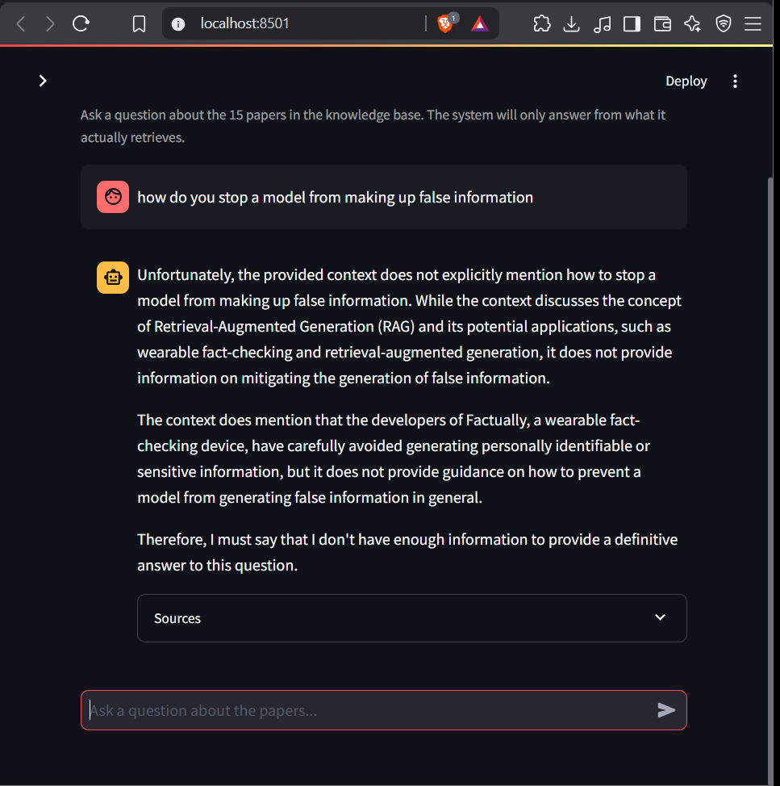

# RAG over arXiv Papers

A Retrieval-Augmented Generation system that answers questions about arXiv research papers on **Retrieval-Augmented Generation itself** — built end to end with local embeddings, a local vector store, cross-encoder re-ranking, a local LLM (Ollama), and a real quantitative evaluation suite. No API keys, no cloud services — everything runs on your own machine.



## Why this exists

Most beginner RAG projects stop at "it retrieves something and the LLM answers." This project goes a step further: it measures retrieval quality against a hand-labeled test set, compares raw embedding search against cross-encoder re-ranking with real numbers, and is explicit about where it fails, not just where it works.

## Evaluation results

Measured against a 13-question hand-labeled test set (`eval/qa_test_set.json`), where each question maps to a specific paper that should be retrieved:

| Metric | Raw embedding retrieval | + Cross-encoder re-ranking |
|---|---|---|
| Hit Rate@5 | 76.9% | **84.6%** |
| Hit Rate@10 | 84.6% | 84.6% |
| MRR | 0.744 | **0.750** |

**What this shows:** re-ranking improved *ranking quality* within the top 5 (one additional question's correct paper got pulled into the top 5, and the "what is Ragas" question moved from rank 6 → rank 4), but it didn't expand *recall* — both methods plateau at the same Hit Rate@10. Two questions were never retrieved correctly by either method, most likely because their relevant content is a minor point within a paper rather than its central focus, or the chunking split that passage awkwardly. Full per-question results are in `eval/results.json`.

## Architecture

```
arXiv API ──▶ PDF download ──▶ text extraction ──▶ chunking (700 chars, overlap)
                                                          │
                                                          ▼
                                          sentence-transformers embeddings
                                                          │
                                                          ▼
                                           Chroma vector store (local)
                                                          │
                            ┌─────────────────────────────┤
                            ▼                              ▼
                  raw similarity search      cross-encoder re-ranking (optional)
                            │                              │
                            └──────────────┬───────────────┘
                                            ▼
                              RAG prompt (grounding instructions)
                                            │
                                            ▼
                                 Ollama (local LLM, llama3.2)
                                            │
                                            ▼
                                  grounded, cited answer
```

## Tech stack

| Layer | Tool |
|---|---|
| Paper ingestion | [arxiv](https://pypi.org/project/arxiv/) API client, [pypdf](https://pypdf.readthedocs.io/) |
| Embeddings | [sentence-transformers](https://www.sbert.net/) (`all-MiniLM-L6-v2`) |
| Vector store | [Chroma](https://www.trychroma.com/) (local, persistent) |
| Re-ranking | [sentence-transformers](https://www.sbert.net/) CrossEncoder (`ms-marco-MiniLM-L-6-v2`) |
| Generation | [Ollama](https://ollama.com/) (`llama3.2`, fully local) |
| UI | [Streamlit](https://streamlit.io/) |

## Quick start

```bash
# 1. Clone the repo
git clone https://github.com/RiyaSingla08/rag-arxiv-papers.git
cd rag-arxiv-papers

# 2. Create and activate a virtual environment
python -m venv venv
source venv/bin/activate        # Mac/Linux
# source venv/Scripts/activate  # Windows (Git Bash)

# 3. Install dependencies
pip install -r requirements.txt

# 4. Install Ollama and pull the model (https://ollama.com/download)
ollama pull llama3.2

# 5. Fetch and process the papers (takes a few minutes)
python src/ingest.py
python src/chunk.py
python src/embed.py

# 6. Try it from the command line
python -m src.retrieve "your question here"
python -m src.generate "your question here" --rerank

# 7. Or launch the chat UI
streamlit run app/streamlit_app.py
```

## Running the evaluation yourself

```bash
python -m src.evaluate
```

This runs all 13 test questions through both raw and re-ranked retrieval and prints a side-by-side comparison, plus a per-question breakdown of exactly which questions' rankings changed.

## Project structure

```
rag-arxiv-papers/
├── src/
│   ├── ingest.py      # fetches papers from arXiv, extracts PDF text
│   ├── chunk.py        # splits text into overlapping chunks
│   ├── embed.py         # generates embeddings, builds the Chroma vector store
│   ├── retrieve.py       # semantic search over the vector store
│   ├── rerank.py          # cross-encoder re-ranking of retrieved candidates
│   ├── generate.py         # full RAG pipeline: retrieve + prompt + generate
│   └── evaluate.py          # retrieval quality evaluation (Hit Rate, MRR)
├── app/
│   └── streamlit_app.py      # chat UI
├── eval/
│   ├── qa_test_set.json       # 13 hand-labeled test questions
│   └── results.json            # evaluation output (regenerated by evaluate.py)
├── data/                        # downloaded PDFs, extracted text, chunks (gitignored)
├── chroma_db/                    # vector store (gitignored, regenerated by embed.py)
├── docs/
│   └── chat-ui-screenshot.png
├── requirements.txt
├── LICENSE
└── README.md
```

## Using different papers or a different topic

Change `SEARCH_QUERY` in `src/ingest.py` to any topic, then re-run steps 5-6 from Quick Start (`ingest.py` → `chunk.py` → `embed.py`). Everything downstream — retrieval, re-ranking, generation, evaluation — works unchanged. You'll need to write a new `eval/qa_test_set.json` for the new topic, since the test questions are tied to the specific papers retrieved.

## Limitations and honest caveats

- Retrieval quality is fundamentally bounded by chunking quality — two test questions were never retrieved correctly by either method, likely because the relevant content wasn't the central focus of any single chunk.
- The evaluation test set is paper-level (does the correct *paper* get retrieved), not answer-level (is the *specific sentence* answering the question retrieved). A finer-grained evaluation would check whether the exact relevant chunk was retrieved, not just any chunk from the correct paper.
- `llama3.2` is a small model chosen for local, CPU-friendly inference — a larger model would likely produce more fluent (though not necessarily more grounded) answers.

## License

MIT — see [LICENSE](LICENSE).
